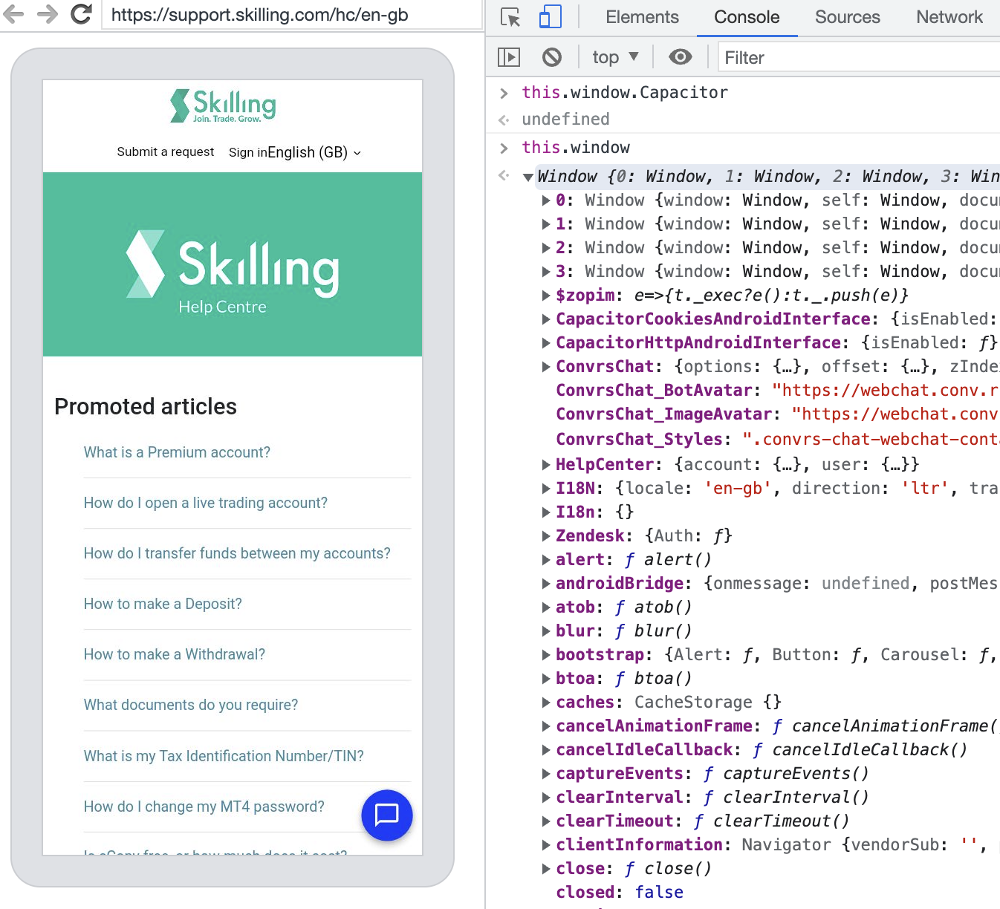
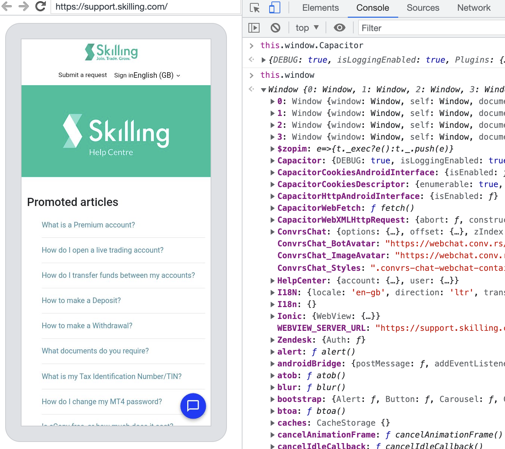

# capacitor-undefined-demo

## Commands to setup project
> `npm init @capacitor/app` was used to create this base project 
> Also added Android app to dependencies `npm i @capacitor/android`

## Run commands

```bash
# Remove previous dependencies to install new custom Android package
cd app && rm -rf node_modules && npm install && npm run build

sh build-android.sh
```

## Steps to reproduce

1. Run app with run commands `sh build-android.sh` (Make sure you install and build app first to create base files)

2. Select emulator Pixel 6 OS 13 API level 33 (Other versions should have same issues to but I include the one I picked for this tests) When we run same tests on Browserstack all Android OS versions have same issues.

3. Open Chrome and go to `chrome://inspect/#devices`.

4. Select emulator in remote targets.

5. Check the Capacitor window object in the browser console.

6. Expected result: `window.Capacitor` is `undefined`

**Screenshot - Capacitor is undefined**


## One workaround that we find

1. Go back to previous commit to get useragent code change with command: `git reset --hard 6a4d793825047207f611c23a9b8690efbf1fbbfa`

2. Rebuild the app with: `sh build-android.sh`

3. Open Chrome and go to `chrome://inspect/#devices`.

4. Select emulator in remote targets.

5. Check the Capacitor window object in the browser console.

6. Expected result: `window.Capacitor` is injected as expected.

**Screenshot - Capacitor is defined**


**Note**

In previous commit we added `appendUserAgent="fooTest"` (for this test any userAgent string works) to `capacitor.config.json`

Changed the order of `appendUserAgent` inside Capacitor Android package. We change this becaue we got another app loading issue when then appened string was added at the end of the useragent string but if we add the string first the app loads properly.

File: `app/packages/@capacitor/android/capacitor/src/main/java/com/getcapacitor/Bridge.java`

**From**
```javascript
String appendUserAgent = this.config.getAppendedUserAgentString();
if (appendUserAgent != null) {
    String defaultUserAgent = settings.getUserAgentString();
    settings.setUserAgentString(defaultUserAgent + " " + appendUserAgent);
}
```

**To**
```javascript
String appendUserAgent = this.config.getAppendedUserAgentString();
if (appendUserAgent != null) {
    String defaultUserAgent = settings.getUserAgentString();
    settings.setUserAgentString(appendUserAgent + " " + defaultUserAgent);
}
```

### Note
We want to get away from manipulate the useragent cause that cause issues with third party.

## Question to Capacitor team
> Have you seen similar issues before?